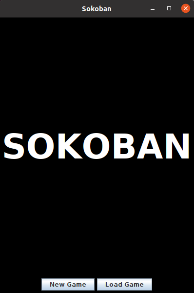

# Sokoban

## Descripción del Proyecto

Sokoban es un proyecto de programación desarrollado como parte de un curso en la Escuela Técnica Superior de Ingenieros en Informática de la Universidad Politécnica de Madrid. Este juego es un rompecabezas en el que el jugador debe mover cajas a posiciones objetivo en un almacén.

## Desarrolladores

Este proyecto fue desarrollado por:

- Cesar Ruiz Deiros
- Andy Ying Ye
- Chenhao Hu
- Oussama El Hatifi Harimi

## Características del Proyecto

El juego de Sokoban implementado en este proyecto incluye las siguientes características:

- [x] **Niveles y Tableros**:
    - El juego está compuesto por varios niveles, cada uno con su propio tablero.
    - Cada tablero está dividido en cuadrados que pueden contener uno de los siguientes elementos: muro, hombre del almacén, caja, posición objetivo.
- [x] **Movimientos y Reglas**:
    - El hombre del almacén puede moverse horizontal o verticalmente.
    - Los muros no pueden ser atravesados.
    - Las cajas pueden ser empujadas horizontal o verticalmente si la siguiente posición está libre o es una posición objetivo.
- [x] **Posiciones Objetivo**:
    - Cuando una caja se coloca en una posición objetivo, el color de la caja debe cambiar.
    - Una posición objetivo solo puede tener una caja.
- [x] **Detección de Nivel Completo**:
    - Un nivel se completa cuando todas las cajas están en una posición objetivo.
- [x] **Lectura de Niveles desde Archivos**:
    - Los niveles se leen desde archivos con el formato `levelN.txt`, donde N es un número positivo.
    - La aplicación debe incluir al menos 3 niveles diferentes.
- [x] **Formato de Archivos de Niveles**:
    - La primera línea contiene el nombre del nivel.
    - La segunda línea contiene dos números que corresponden a las dimensiones del tablero (nFilas y nColumnas).
    - Las siguientes líneas contienen los elementos del tablero con los siguientes símbolos:
        - `+` : Muro
        - `.` : Cuadrado vacío
        - `*` : Posición objetivo
        - `#` : Caja
        - `W` : Hombre del almacén
- [x] **Validación de Niveles**:
    - Los niveles deben ser correctos, con al menos una caja y una posición objetivo, un único hombre del almacén, y el mismo número de cajas y posiciones objetivo.
- [x] **Puntuación**:
    - La puntuación de un nivel es el número de movimientos realizados por el hombre del almacén.
    - La puntuación total del juego es la suma de las puntuaciones de todos los niveles.
- [x] **Guardar y Cargar Juego**:
    - El juego debe permitir guardar y cargar el estado actual.
- [x] **Menú de Juego**:
    - Iniciar un nuevo juego
    - Reiniciar el nivel actual
    - Deshacer el último movimiento
    - Guardar el juego
    - Abrir un juego guardado
    - Cerrar la aplicación

## Capturas de Pantalla




## Instrucciones de Instalación

1. Clonar el repositorio:
   ```sh
   git clone https://costa.ls.fi.upm.es/gitlab/groupprojectpp/sokobanproject.git

2. Compilar y ejecutar el proyecto
    ```sh
   mvn clean compile exec:java
